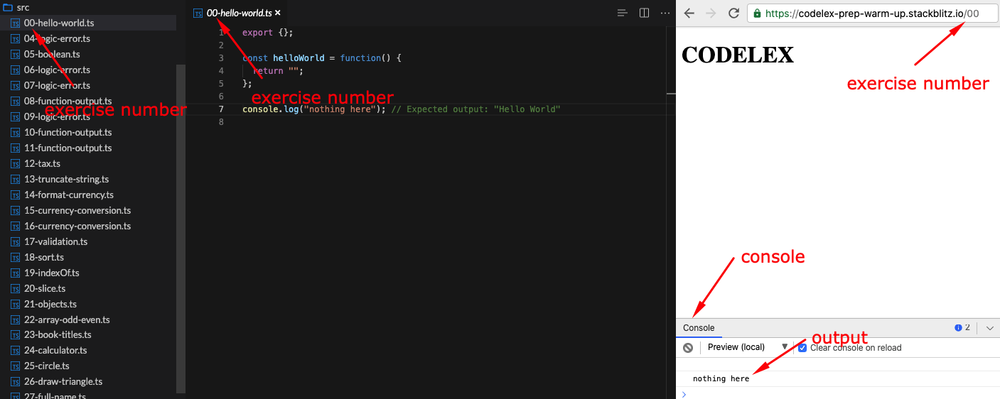

# CODELEX Prep-Course Warm-Up 🔥

This project is available [here @stackblitz.com](https://stackblitz.com/edit/codelex-prep-warm-up?file=src/00-hello-world.ts)

## Running an Exercise

To run any exercise input it's number after the url in the preview window and observe the output in the console (you can drag it up)

